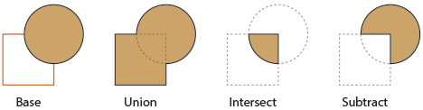

# Boolean Operations

[Boolean][] operations are ways to combine simple geometries into complex ones. Three [Boolean][] operations are supported in [Geant4](../..): UNION, SUBTRACTION, and INTERSECTION, as shown in the figure below.

> **Note**
> There is no need to use [Boolean][] operation to dig a hole inside a larger volume in order to place a smaller one inside the larger one. Placing a small volume directly inside a larger one won't create overlapping. Instead, the smaller volume becomes a daughter volume of the larger one, and its material replaces that of the larger one.

[Boolean]: https://geant4-userdoc.web.cern.ch/UsersGuides/ForApplicationDeveloper/html/Detector/Geometry/geomSolids.html#solids-made-by-boolean-operations
